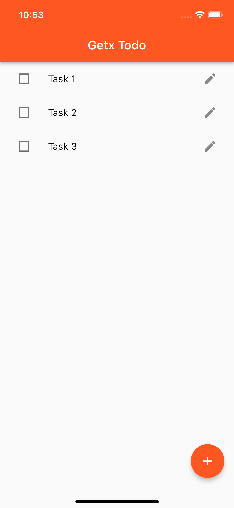
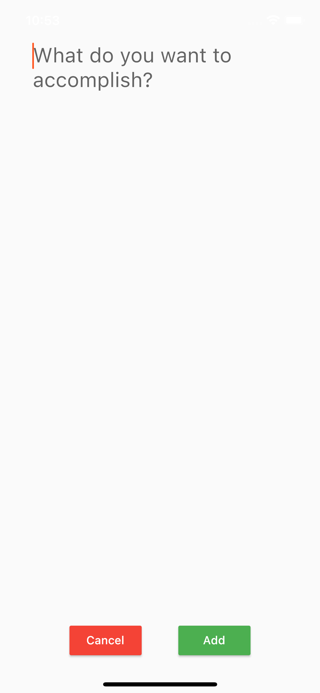
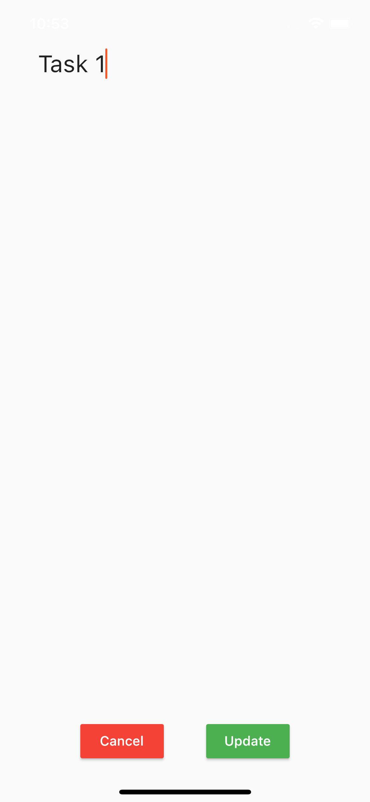

# Flutter Yapılacaklar Listesi Uygulaması

Flutter ile yapılacaklar listesi uygulaması

## Ekran Görüntüleri

|     |     |    |
| :-: | :-: |:-: |
|  Homescreen | Add Todo | Edit Todo |
|  |  |  |

## Kurulum
Bu projeyi kendi bilgisayarınızda çalıştırmak için aşağıdaki adımları takip edin:
1. Projeyi klonlayın.
2. 'flutter pub get' komutunu çalıştırın.
3. Projeyi 'flutter run' komutuyla veya kullandığınız IDE'nin araçlarıyla çalıştırın.

Flutter'a başlarken yardım almak için çevrimiçi dokümantasyonu inceleyebilirsiniz. Dokümantasyon, mobil uygulama geliştirme konusunda örnekler, rehberler ve tam bir API referansı sunmaktadır.

